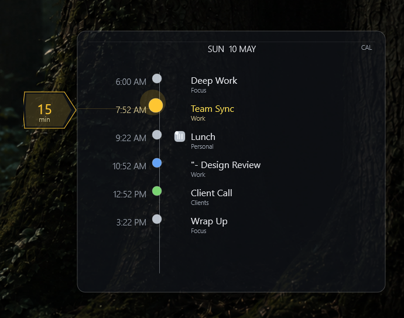
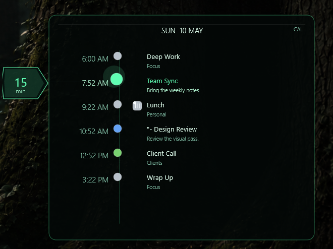
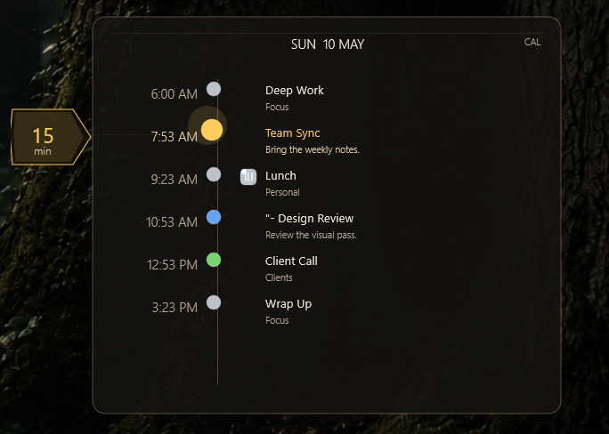
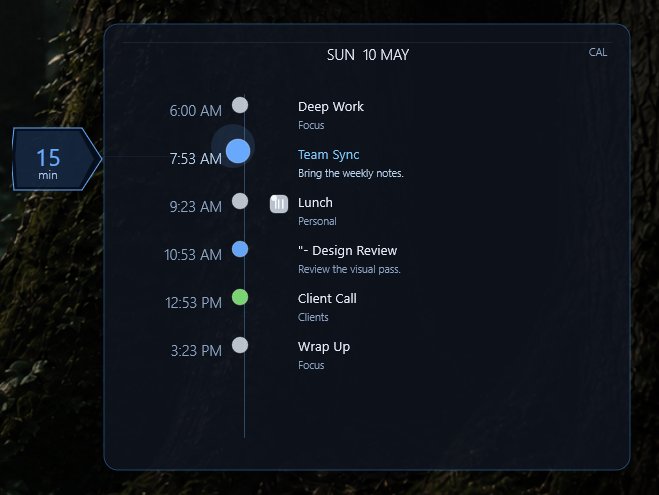
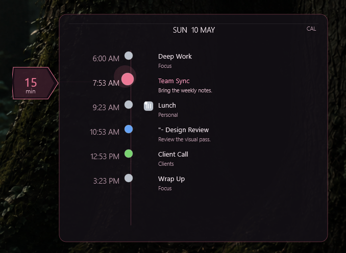
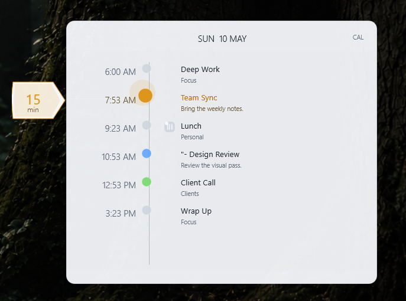
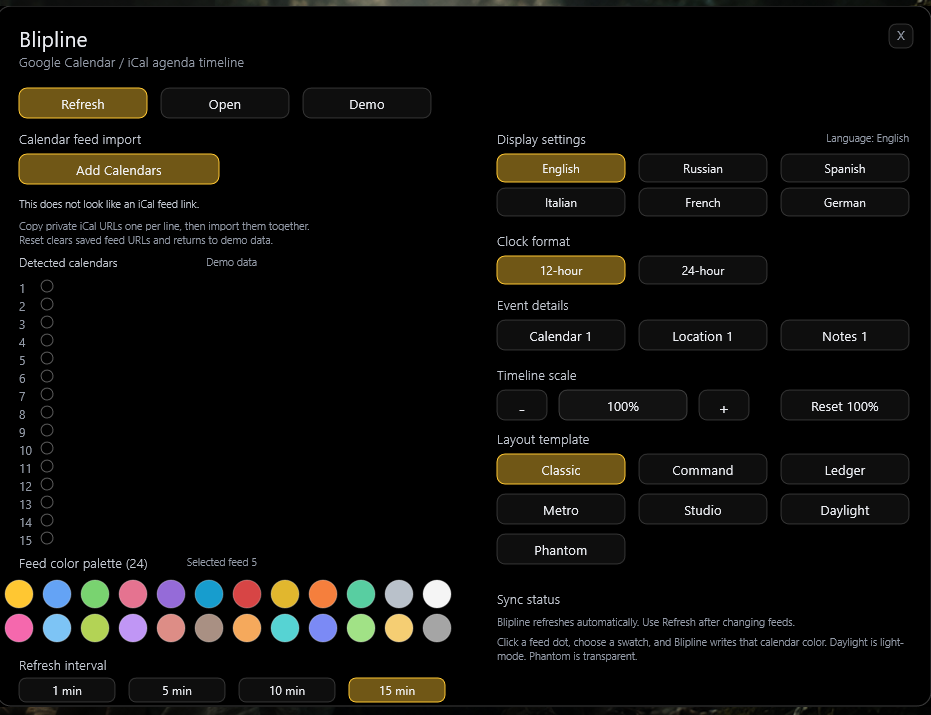
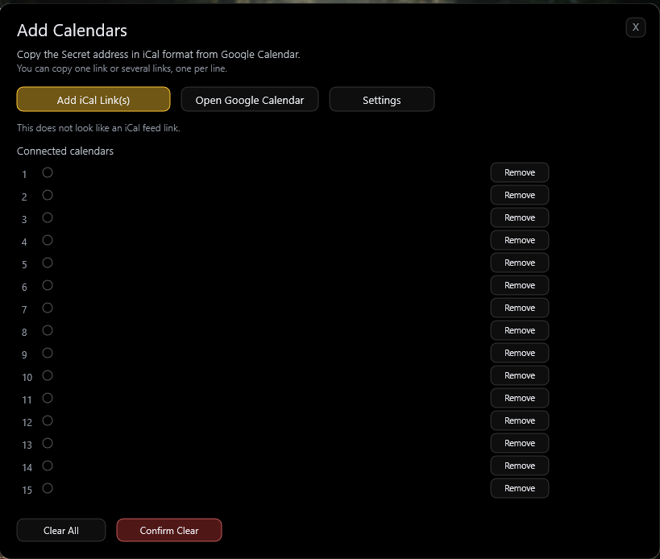

# Blipline

Blipline is a Rainmeter calendar timeline that keeps your day visible without turning your desktop into a full calendar app.

Connect Google Calendar or any iCal feed, then glance over to see what is happening now, what is next, and how much time you have in between.



## Download

Current beta: `v0.3.22-beta.1`

Download the `.rmskin` from the [latest release](https://github.com/PetersMinistry/rainmeter-blipline/releases/latest).

## Features

- A clean desktop timeline for upcoming and recent events.
- Highlighting for the current event or the next thing on your schedule.
- A countdown tag that keeps the next timed event in view.
- Mouse-wheel scrolling through cached past and future events.
- Click the countdown tag to jump back to the current or next event.
- Connect up to 15 calendar feeds.
- Add several iCal links at once without replacing calendars already connected.
- Auto-detected calendar names and colors when your provider supplies them.
- A 24-color palette for feeds you want to color yourself.
- Seven layout templates, including a transparent Phantom option.
- Adjustable timeline scale, refresh interval, language, clock format, and event details.
- Daily, weekly, monthly, and yearly recurring-event support.
- Support for edited instances of recurring events.
- All-day events and overnight timed events displayed correctly.

## Templates

Choose a layout that fits your desktop. All templates use the same footprint, so changing styles does not shove your timeline around.

| Classic | Command |
| --- | --- |
|  |  |

| Ledger | Metro |
| --- | --- |
|  |  |

| Studio | Daylight |
| --- | --- |
|  |  |

## Getting Started

Install the `.rmskin`, then open the Blipline Settings panel:

```text
Blipline\Control\Settings.ini
```



From Settings, you can add calendars, choose a layout, adjust the timeline size, and decide how often Blipline refreshes.

When your calendars are connected, load the timeline:

```text
Blipline\Timeline\Timeline.ini
```

## Add a Calendar

Blipline uses iCal links. For Google Calendar, open the calendar's settings and copy its **Secret address in iCal format**.

Then:

1. Open Settings and select **Add Calendars**.
2. Copy one or more iCal links to your clipboard.
3. Select **Add iCal Link(s)**.
4. Return to Settings to pick colors, a layout, and your preferred display options.



You can add feeds later, remove individual calendars, or clear the whole list and start fresh.

## Make It Yours

Use Settings to tailor Blipline to your desktop:

- Pick from Classic, Command, Ledger, Metro, Studio, Daylight, or Phantom.
- Resize the timeline with the minus and plus controls, or enter an exact scale.
- Choose 12-hour or 24-hour time.
- Show or hide calendar names, locations, and notes.
- Set refreshes to 1, 5, 10, or 15 minutes.
- Use detected calendar colors or choose from the built-in palette.

## Requirements

- Rainmeter 4.5 or newer
- Windows 10 or newer
- Google Calendar or another calendar provider that offers iCal / ICS feeds

## Status

Blipline is currently in beta. It is ready for everyday use, with more calendar connection options planned for later.
