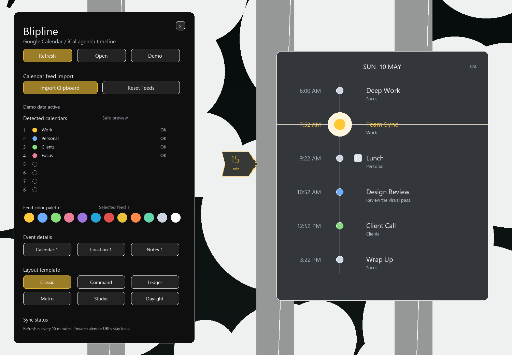
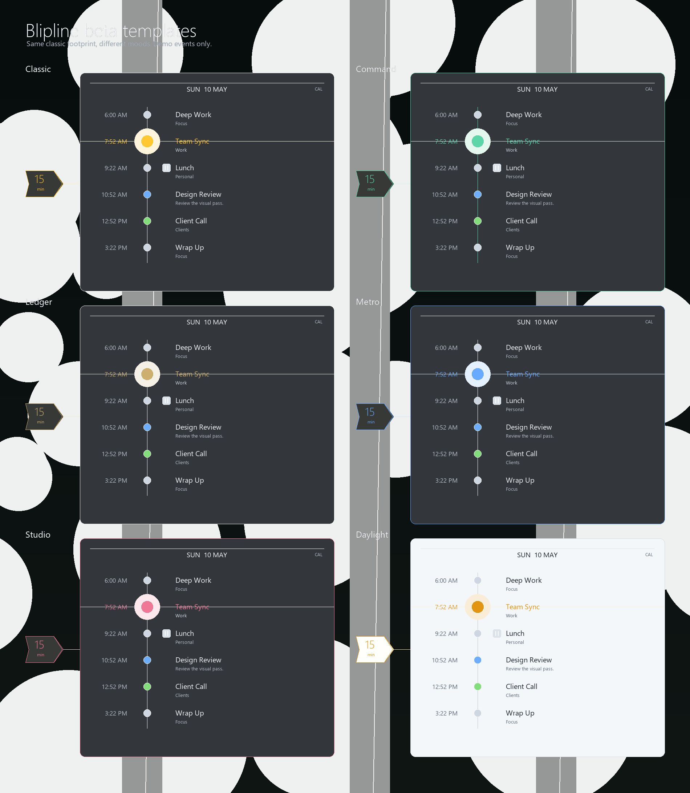

# Blipline

Blipline is a Rainmeter agenda timeline for Google Calendar-style private iCal feeds. It turns upcoming events into a smooth desktop schedule: current item in focus, next-event countdown on the side, and a scrollable timeline for looking ahead or back.



## Download

First beta: `v0.3.0-beta.1`

Get the `.rmskin` from the [latest GitHub release](https://github.com/PetersMinistry/rainmeter-blipline/releases/latest).

## What It Does

- Shows a timeline-style agenda with the current or next event highlighted.
- Keeps a side countdown tag visible so the next thing is always obvious.
- Scrolls through cached past and future events with the mouse wheel.
- Clicks the countdown tag to glide back to the current or next event.
- Imports multiple Google Calendar private iCal URLs from the clipboard, one per line.
- Supports up to eight iCal feed slots.
- Merges multiple calendars into one readable agenda.
- Auto-detects calendar names and iCal feed colors when the feed provides them.
- Lets you assign feed colors from a built-in palette when Google does not expose colors.
- Includes event detail toggles for calendar name, location, and notes.
- Handles daily, weekly, monthly, and yearly recurring events.
- Handles edited single instances of recurring events through `RECURRENCE-ID`.
- Keeps smaller calendars visible with per-calendar cache backfill.
- Preserves Unicode and emoji-friendly event text as far as Rainmeter allows.
- Includes a safe Demo mode with sample events and no private calendar data.
- Refreshes every 15 minutes, with a manual Refresh button in settings.

## Templates

The beta includes six layout templates. They share the same Classic footprint so switching templates does not make the skin jump wider or taller.



Templates:

- Classic
- Command
- Ledger
- Metro
- Studio
- Daylight light mode

## Load Paths

After installing, load the setup panel first:

```text
Blipline\Control\Settings.ini
```

The timeline display is:

```text
Blipline\Timeline\Timeline.ini
```

The beta package opens the settings panel first so new users can import feeds, test Demo mode, pick colors, and choose a template before loading the timeline.

## Google Calendar Setup

In Google Calendar, copy each calendar private iCal URL. In Blipline settings, place each URL on its own clipboard line, then click Import Clipboard.

Private iCal URLs are secret read-only links. Anyone with one can read that calendar feed, so do not post them publicly.

## Privacy

- Private iCal URLs are not committed to this repo.
- Generated agenda cache files are ignored because they may contain event titles, locations, notes, and meeting details.
- The committed `UserSettings.inc` keeps feed URLs, helper paths, and runtime feed status blank.
- Release packages are built from the Git-tracked source tree, not from the live Rainmeter install folder.
- Live/local setup files stay local.

## Requirements

- Rainmeter 4.5 or newer.
- Windows 10 or newer.
- Private iCal links from Google Calendar or another iCal/ICS-compatible calendar provider.

## Verification

Maintainer checks used for this beta:

```powershell
powershell.exe -NoProfile -ExecutionPolicy Bypass -File .\tools\Test-AgendaPipeline.ps1
powershell.exe -NoProfile -ExecutionPolicy Bypass -File .\tools\Test-ReleasePrivacy.ps1
```

The agenda test uses fake calendar data only. The release privacy test blocks packaging if source settings contain private feed URLs, helper paths, generated cache files, or runtime feed status.

## Status

`0.3.0` is the first public beta. It is usable, but still beta. OAuth/Google sign-in calendar selection is not included yet; the current setup path is private iCal import.
